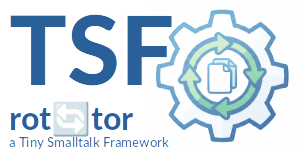

|<sub>🇩🇪 [German translation →](README.de.md)</sub>|
|----:|
|    |

|[](https://pharo.org)|[](./LICENSE) [](#)|
|----|----|
|| ***TSF-FileRotator***<br>A robust, process-independent file rotator for Pharo Smalltalk. Part of the **TSF (Tiny Smalltalk Framework)**-Suite|

<sup>***TSF*** stands for ***Tiny Smalltalk Framework*** — a collection of minimalist tools for robust applications.</sup>

## Overview

The **TSF-FileRotator** is a plugin for the TSF suite. It monitors files (e.g., logs), rotates them based on configurable policies (size, age), and archives them.. 
It was specifically designed for heterogeneous environments (e.g. **Go-Logger & Pharo-Rotator**) and uses file-based locks to reliably avoid conflicts..

## Features

* **Process-Agnostic:** Rotates files written by other processes (Go, Python, OS).
* **Robust Locking:**
    * Uses `.LOCK` files for synchronisation.
    * *Stale-Lock-Protection:* Automatically cleans up orphaned locks after crashes.
    * *Retry-Logik:* Waits during short write operations (Spin-Lock with Backoff).
* **Modulare Architektur:**
    * **RotationPolicy:** When will it rotate? (e.g. `TsfFileSizeLimitPolicy`).
    * **ArchiveStrategy:** How is stored?? (e.g. `TsfZipArchiveStrategy` or `TsfNoCompressionStrategy`).
    * **RetentionPolicy:** How many backups will be kept? (e.g. `TsfCountRetentionPolicy`).
* **Scheduler-Integration:** Implementied as `TsfTask` for the `tsf-scheduler`.
* **Dual Use:** 
    * with **TsfScheduler** Started periodically or onDemand with `TsfFileRotationTask >> schedule`.
	* **Standalone** Started with `TsfFileRotationTask >> executeAction`.


## Installation

```smalltalk
Metacello new
    baseline: 'TsfFileRotator';
    repository: 'github://georghagn/tsf-file-rotator:main';
    load.
```

## Usage

The rotator is registered as a task in the scheduler. 
Example: Log-Rotation with Zip and Cleanup

```smalltalk
| logFile rotTask |

"1. Die zu überwachende Datei"
logFile := FileSystem workingDirectory / 'server.log'.

"2. Den Task konfigurieren"
rotTask := TsfFileRotationTask new 
    initializeWithFiles: { logFile }
    rotationPolicy: (TsfFileSizeLimitPolicy new limit: 10 * 1024 * 1024) "10 MB"
    archiveStrategy: (TsfZipArchiveStrategy new)     "Als .zip speichern"
    retentionPolicy: (TsfCountRetentionPolicy new maxCount: 5). "Max 5 Backups"

"3. Dem Scheduler hinzufügen (Pseudo-Code für TSF-Scheduler)"
TsfScheduler instance addTask: rotTask every: 5 minutes.
```


## How it works

* **Check:** The task periodically checks whether server.log exceeds the limit (e.g., 10MB).
* **Lock:** It is attempting to create server.log.LOCK.
        If available: It waits briefly (retries). If still locked, it aborts.
        If the lock is "outdated" (> 60s): It clears the lock (self-healing).
* **Rotate:** \*.server.log will be renamed to server.log.2023-11-24_10-00-00.

The external logger (Go/Pharo) automatically opens a new server.log file on the next write attempt.

* **Archive:** The .bak file is compressed to .zip and the original is deleted.
* **Retention:** Old backups (older than the last 5) will be deleted.
* **Unlock:** The .LOCK file will be removed.

## Dependencies 
<sup>*(not included in Pharo Standard Image/Library)*</sup>

* TSF-Scheduler
    
## Development-Process & Credits

Special thanks go to my AI sparring partner for the intensive and valuable discussions during the design phase. The AI's ability to quickly outline different architectural approaches (such as an inlined anonyme subclass of the FIleRotatorTask for testing purposes) and weigh their pros and cons significantly accelerated the development of `TSF-FileRotator` and improved the robustness of the final result.


## License

MIT

## Contact

If you have any questions or are interested in this project, you can reach me at
📧 **dev.georgh [at] hconsult.biz**

<sup>*(Please do not send inquiries to the private GitHub account addresses.)*</sup>

